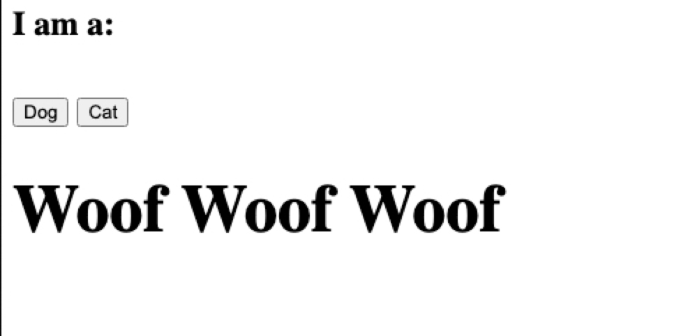

# s3statichtmlwithterraform
Static HTML With S3 Buckets and CloudFront deployed with terraform modules

## The goal of this repo is create in a fast way a static website out of S3 buckets and CloudFront Distribution.

0 Register a new domain with your favourite registarar and add NS servers as in route53

1 Edit the main.tf and add the domain and chose your AWS Region 

2 Execute terraform init
          terraform apply --auto-approve
          
3 Execute the command cp.sh domain to compy the index.html as example.

4 Test the domain in your browser the sucessfull test shoul show 

